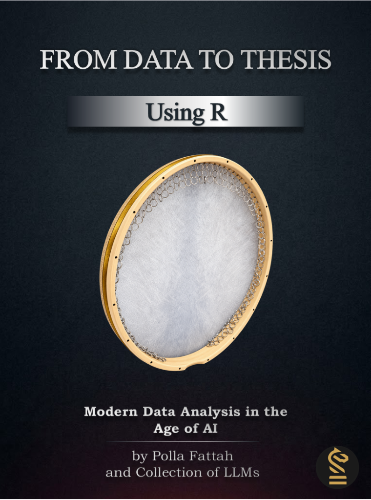
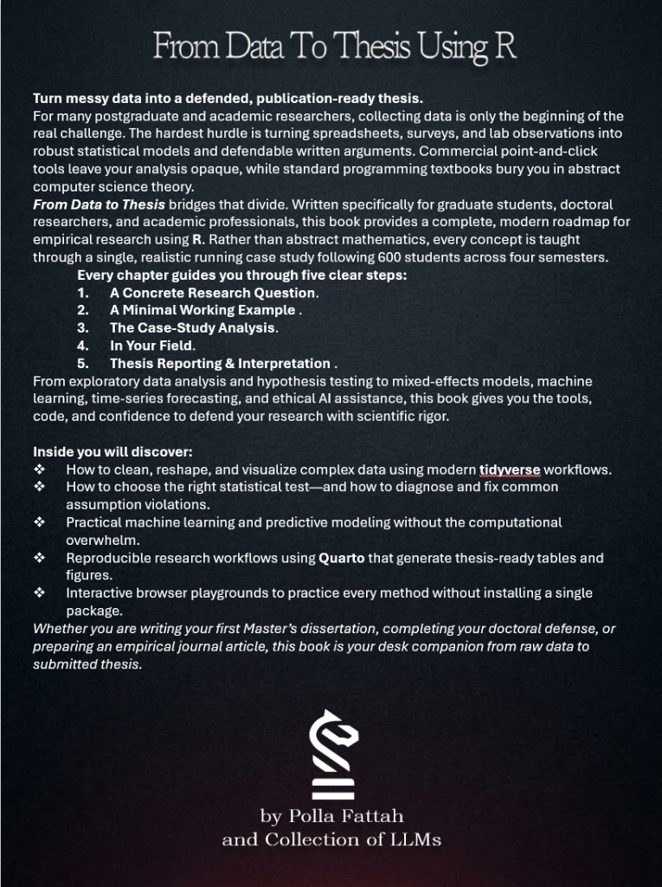

```{=html}
<div class="landing container">

<section class="hero">
  <div class="row align-items-center g-5">
    <div class="col-lg-7">
      <h1>FROM DATA TO THESIS</h1>
      <div class="subtitle">Using R for Non-Technical</div>
      <p class="lead">Follow one Master's thesis from a messy survey export to results that can be defended. Every method in the book answers one of the study's research questions, so you learn R the way you will use it: on a real research project.</p>
      <p>No programming or statistics background needed.</p>
      <div class="actions">
        <a class="btn btn-primary btn-lg" href="content/book/index.html">Start reading</a>
        <a class="btn btn-outline-primary btn-lg" href="downloads/From-Data-to-Thesis.pdf" download><i class="bi bi-file-earmark-pdf"></i> Download PDF</a>
        <a class="btn btn-outline-primary btn-lg" href="content/playground/index.html">Try the playground</a>
        <a class="btn btn-outline-primary btn-lg" href="content/slides/index.html">Lecture slides</a>
      </div>
    </div>
    <div class="col-lg-5 text-center">
      <div class="book-3d-wrap">
        <div class="book-3d-card" id="bookCard" onclick="this.classList.toggle('flipped')" title="Click to flip cover">
          <div class="book-side book-front">
            
          </div>
          <div class="book-side book-back">
            
          </div>
        </div>
        <div class="cover-flip-hint">
          <button type="button" class="btn-flip" id="btnFlipCover" onclick="document.getElementById('bookCard').classList.toggle('flipped')">
            <i class="bi bi-arrow-repeat"></i> <span id="flipLabel">View Back Cover</span>
          </button>
        </div>
      </div>
    </div>
  </div>
</section>

<section>
  <div class="section-head">
    <h2>The book in numbers</h2>
  </div>
  <div class="row g-3">
    <div class="col-12 col-md-4 metric"><div class="value">19</div><div class="label">chapters</div><div class="note">from a first R command to a finished thesis chapter</div></div>
    <div class="col-12 col-md-4 metric"><div class="value">600</div><div class="label">students</div><div class="note">in the case study, followed over four semesters</div></div>
    <div class="col-12 col-md-4 metric"><div class="value">12</div><div class="label">research questions</div><div class="note">each one answered with a different method</div></div>
  </div>
</section>

<section>
  <div class="section-head">
    <h2>How every chapter works</h2>
    <p>The same five steps, so you always know where you are.</p>
  </div>
  <div class="row justify-content-center">
    <div class="col-lg-8">
      <div class="step"><div class="num">1</div><div><h3>A research question</h3><p>Each chapter starts with a question from the case-study thesis, such as "Does the wellbeing workshop help?"</p></div></div>
      <div class="step"><div class="num">2</div><div><h3>A tiny example</h3><p>The new idea is shown on a handful of numbers, so you can see exactly what it does.</p></div></div>
      <div class="step"><div class="num">3</div><div><h3>The case-study data</h3><p>The same tool is applied to the real case study, and you learn how to report the result in a thesis.</p></div></div>
      <div class="step"><div class="num">4</div><div><h3>In your field</h3><p>A short box shows the same method in health, agriculture, or business research.</p></div></div>
      <div class="step"><div class="num">5</div><div><h3>Practise</h3><p>Exercises in the playground: in your browser, or as a project to download and open in RStudio.</p></div></div>
    </div>
  </div>
</section>

<section>
  <div class="section-head">
    <h2>Learning paths</h2>
    <p>Start where you are.</p>
  </div>
  <div class="row g-4">
    <div class="col-md-6 col-lg-3"><div class="path-card"><div class="tag">No experience needed</div><h3>The complete path</h3><p>All chapters in order, from installing R to presenting your results.</p></div></div>
    <div class="col-md-6 col-lg-3"><div class="path-card"><div class="tag">Used SPSS or Excel</div><h3>Coming from SPSS</h3><p>See how familiar tasks map to R, import your SPSS files with their labels, then move on to Part 2.</p></div></div>
    <div class="col-md-6 col-lg-3"><div class="path-card"><div class="tag">Classic statistics</div><h3>Statistics for your thesis</h3><p>Parts 1 and 2: describing data, hypothesis tests, ANOVA, regression, and mixed models.</p></div></div>
    <div class="col-md-6 col-lg-3"><div class="path-card"><div class="tag">Know the basics</div><h3>Towards machine learning</h3><p>Part 3: prediction, classification, clustering, neural networks, and forecasting.</p></div></div>
  </div>
</section>

<section>
  <div class="section-head">
    <h2>The arc of the book</h2>
  </div>
  <div class="row justify-content-center">
    <div class="col-lg-8">
      <div class="timeline">
        <div class="item"><div class="when">Part 1 · Chapters 1 to 4</div><h3>Foundations</h3><p>R and RStudio, data structures, cleaning and reshaping a messy survey export, and your first plots.</p></div>
        <div class="item"><div class="when">Part 2 · Chapters 5 to 10</div><h3>Statistical analysis for research</h3><p>Research questions and hypotheses, describing data, hypothesis tests, ANOVA and regression, questionnaire scales, and change over time.</p></div>
        <div class="item"><div class="when">Part 3 · Chapters 11 to 16</div><h3>Machine learning with R</h3><p>Predicting who might drop out, finding student profiles, neural networks, and forecasting.</p></div>
        <div class="item"><div class="when">Part 4 · Chapters 17 to 19</div><h3>Reproducible research and applications</h3><p>Quarto reports, Shiny dashboards, using AI tools responsibly, and a complete project from raw data to thesis chapter.</p></div>
      </div>
    </div>
  </div>
</section>

<section>
  <div class="section-head">
    <h2>Tools you will use</h2>
    <p>All free and open source.</p>
  </div>
  <div class="row g-3">
    <div class="col-6 col-md-4 col-lg-2"><div class="tool"><strong>R</strong><span>the language for analysis</span></div></div>
    <div class="col-6 col-md-4 col-lg-2"><div class="tool"><strong>RStudio / Positron</strong><span>where you write R</span></div></div>
    <div class="col-6 col-md-4 col-lg-2"><div class="tool"><strong>tidyverse</strong><span>cleaning and plotting</span></div></div>
    <div class="col-6 col-md-4 col-lg-2"><div class="tool"><strong>tidymodels</strong><span>machine learning</span></div></div>
    <div class="col-6 col-md-4 col-lg-2"><div class="tool"><strong>Quarto</strong><span>reproducible reports</span></div></div>
    <div class="col-6 col-md-4 col-lg-2"><div class="tool"><strong>webR</strong><span>R in your browser</span></div></div>
  </div>
</section>

<section id="get-the-data">
  <div class="section-head">
    <h2>Get the data</h2>
    <p>The student wellbeing data comes as ordinary files and as an R package. The book teaches both.</p>
  </div>
  <div class="row justify-content-center">
    <div class="col-lg-8">
```

Install the package from this website:

```r
install.packages("https://polla.dev/data2thesis_r/downloads/data2thesis_1.1.0.tar.gz",
                 repos = NULL, type = "source")
library(data2thesis)
head(students)
```

Or download the [package file](downloads/data2thesis_1.1.0.tar.gz) and the [data files on GitHub](https://github.com/polla-fattah/data2thesis_r/tree/main/data).

**Please note:** the case study and its data are fictional: the data was generated by a computer program to look realistic, and its patterns were built in by the author. It describes no real people and is not evidence about real students; do not cite or use it as research findings.

```{=html}
    </div>
  </div>
</section>

<section>
  <div class="section-head">
    <h2>Frequently asked questions</h2>
  </div>
  <div class="row justify-content-center">
    <div class="col-lg-8">
      <details id="about-the-book">
        <summary>What is this book about? (Full back-cover description)</summary>
        <p><strong>Turn messy data into a defended, publication-ready thesis.</strong></p>
        <p>For many postgraduate and academic researchers, collecting data is only the beginning of the real challenge. The hardest hurdle is turning spreadsheets, surveys, and lab observations into robust statistical models and defendable written arguments. Commercial point-and-click tools leave your analysis opaque, while standard programming textbooks bury you in abstract computer science theory.</p>
        <p><em>From Data to Thesis</em> bridges that divide. Written specifically for graduate students, doctoral researchers, and academic professionals, this book provides a complete, modern roadmap for empirical research using <strong>R</strong>. Rather than abstract mathematics, every concept is taught through a single, realistic running case study following 600 students across four semesters.</p>
        <p><strong>Every chapter guides you through five clear steps:</strong></p>
        <ol>
          <li><strong>A Concrete Research Question</strong> — Rooted in authentic academic inquiry.</li>
          <li><strong>A Minimal Working Example</strong> — To build immediate, intuitive understanding.</li>
          <li><strong>The Case-Study Analysis</strong> — Applied data cleaning, visualization, and modeling.</li>
          <li><strong>In Your Field</strong> — Transferable applications across healthcare, social sciences, agriculture, and business.</li>
          <li><strong>Thesis Reporting & Interpretation</strong> — The exact wording, tables, and APA-style figures you need for your final draft.</li>
        </ol>
        <p>From exploratory data analysis and hypothesis testing to mixed-effects models, machine learning, time-series forecasting, and ethical AI assistance, this book gives you the tools, code, and confidence to defend your research with scientific rigor.</p>
        <hr>
        <p><strong>Inside you will discover:</strong></p>
        <ul>
          <li>How to clean, reshape, and visualize complex data using modern <strong>tidyverse</strong> workflows.</li>
          <li>How to choose the right statistical test—and how to diagnose and fix common assumption violations.</li>
          <li>Practical machine learning and predictive modeling without the computational overwhelm.</li>
          <li>Reproducible research workflows using <strong>Quarto</strong> that generate thesis-ready tables and figures.</li>
          <li>Interactive browser playgrounds to practice every method without installing a single package.</li>
        </ul>
        <p><em>Whether you are writing your first Master’s dissertation, completing your doctoral defense, or preparing an empirical journal article, this book is your desk companion from raw data to submitted thesis.</em></p>
      </details>
      <details><summary>Do I need to know programming or statistics?</summary><p>No. The book starts from zero and explains every term when it first appears. Each new idea is shown first on a tiny example before it is used on real data.</p></details>
      <details><summary>Is the data real?</summary><p>No. The student, her study, and her data are fictional. The data was generated by a computer program to look like a realistic survey of graduate students, so that every method in this book has something to find. It describes no real people, and its patterns (for example, that the workshop raised wellbeing, or that students who sleep more have higher grades) were built into the program by the author, not discovered. Nothing in this book is evidence about the wellbeing of real students, and the data and results must not be cited or used as findings about students, universities, or any real situation. The same applies to the counselling service's records and to the students' written answers. It was designed so that every method in the book finds something worth interpreting, including some honest "no effect" results. The script that generates it is published, so anyone can check or regenerate it.</p></details>
      <details><summary>My research is not in education. Is the book for me?</summary><p>Yes. The methods are the same in every field. "In your field" boxes in each chapter show the same method on real data from health, agriculture, and business research.</p></details>
      <details><summary>Do I need to install anything to start?</summary><p>Not for the playground: its exercises run in your browser. To follow the book on your own computer you will install R and RStudio, and Chapter 1 shows you how.</p></details>
      <details><summary>Does it cover AI tools?</summary><p>Yes. Chapter 18 shows how to use AI assistants to write and check R code, how to analyse open-ended answers with a language model, and how to use AI responsibly in research.</p></details>
    </div>
  </div>
</section>

<style>
.read-download-section {
  margin: 3.5rem 0 2rem 0;
  width: 100%;
}

.read-download-banner {
  background-color: #0b1120;
  background-image: 
    linear-gradient(rgba(255, 255, 255, 0.04) 1px, transparent 1px),
    linear-gradient(90deg, rgba(255, 255, 255, 0.04) 1px, transparent 1px);
  background-size: 24px 24px;
  border: 1px dashed rgba(217, 119, 6, 0.45);
  border-radius: 14px;
  padding: 34px 38px;
  display: flex;
  align-items: center;
  justify-content: space-between;
  gap: 32px;
  box-shadow: 0 10px 25px -5px rgba(0, 0, 0, 0.35);
  transition: border-color 200ms ease;
}

.read-download-banner:hover {
  border-color: rgba(245, 158, 11, 0.7);
}

.read-download-text {
  flex: 1;
  min-width: 260px;
}

.read-download-title {
  color: #ffffff !important;
  font-size: 1.25rem !important;
  font-weight: 750 !important;
  margin: 0 0 8px 0 !important;
  letter-spacing: -0.01em;
  font-family: inherit;
}

.read-download-desc {
  color: #94a3b8 !important;
  font-size: 0.94rem !important;
  line-height: 1.55 !important;
  margin: 0 !important;
  max-width: 560px;
}

.read-download-actions {
  display: flex;
  align-items: center;
  gap: 12px;
  flex-wrap: wrap;
  flex-shrink: 0;
}

.btn-banner {
  display: inline-flex;
  align-items: center;
  gap: 8px;
  padding: 10px 18px;
  border-radius: 8px;
  font-size: 0.92rem;
  font-weight: 700;
  text-decoration: none !important;
  transition: all 160ms ease;
  white-space: nowrap;
  line-height: 1.3;
}

.btn-banner svg {
  flex-shrink: 0;
}

.btn-banner-green {
  background-color: #059669;
  color: #ffffff !important;
  border: 1px solid #059669;
  box-shadow: 0 2px 8px rgba(5, 150, 105, 0.35);
}

.btn-banner-green:hover {
  background-color: #047857;
  border-color: #047857;
  transform: translateY(-1px);
  box-shadow: 0 4px 14px rgba(5, 150, 105, 0.5);
}

.btn-banner-dark {
  background-color: rgba(255, 255, 255, 0.05);
  color: #ffffff !important;
  border: 1px solid rgba(255, 255, 255, 0.28);
}

.btn-banner-dark:hover {
  background-color: rgba(255, 255, 255, 0.12);
  border-color: rgba(255, 255, 255, 0.5);
  transform: translateY(-1px);
}

@media (max-width: 991px) {
  .read-download-banner {
    flex-direction: column;
    align-items: flex-start;
    padding: 26px 24px;
    gap: 22px;
  }
  
  .read-download-actions {
    width: 100%;
  }
}
</style>

<section class="read-download-section">
  <div class="read-download-banner">
    <div class="read-download-text">
      <h3 class="read-download-title">Read the Complete Book Online or Download</h3>
      <p class="read-download-desc">View all 19 chapters entirely in your browser, download the full PDF with covers and bookmarks, or read chapter by chapter.</p>
    </div>
    <div class="read-download-actions">
      <a href="content/book/full/index.html" class="btn-banner btn-banner-green">
        <svg xmlns="http://www.w3.org/2000/svg" width="17" height="17" viewBox="0 0 24 24" fill="none" stroke="currentColor" stroke-width="2" stroke-linecap="round" stroke-linejoin="round"><path d="M2 3h6a4 4 0 0 1 4 4v14a3 3 0 0 0-3-3H2z"></path><path d="M22 3h-6a4 4 0 0 1 3-3h7z"></path></svg>
        <span>View Entirely (HTML)</span>
      </a>
      <a href="downloads/From-Data-to-Thesis.pdf" class="btn-banner btn-banner-green" download>
        <svg xmlns="http://www.w3.org/2000/svg" width="17" height="17" viewBox="0 0 24 24" fill="none" stroke="currentColor" stroke-width="2" stroke-linecap="round" stroke-linejoin="round"><path d="M14 2H6a2 2 0 0 0-2 2v16a2 2 0 0 0 2 2h12a2 2 0 0 0 2-2V8z"></path><polyline points="14 2 14 8 20 8"></polyline><line x1="12" y1="18" x2="12" y2="12"></line><line x1="9" y1="15" x2="15" y2="15"></line></svg>
        <span>Download (PDF)</span>
      </a>
      <a href="content/book/01-getting-started.html" class="btn-banner btn-banner-dark">
        <svg xmlns="http://www.w3.org/2000/svg" width="17" height="17" viewBox="0 0 24 24" fill="none" stroke="currentColor" stroke-width="2" stroke-linecap="round" stroke-linejoin="round"><circle cx="12" cy="12" r="10"></circle><polygon points="16.24 7.76 14.12 14.12 7.76 16.24 9.88 9.88 16.24 7.76"></polygon></svg>
        <span>Start Chapter 1</span>
      </a>
    </div>
  </div>
</section>

<script>
  const card = document.getElementById('bookCard');
  const label = document.getElementById('flipLabel');
  if (card && label) {
    const observer = new MutationObserver(() => {
      label.textContent = card.classList.contains('flipped') ? 'View Front Cover' : 'View Back Cover';
    });
    observer.observe(card, { attributes: true, attributeFilter: ['class'] });
  }
</script>

</div>
```
